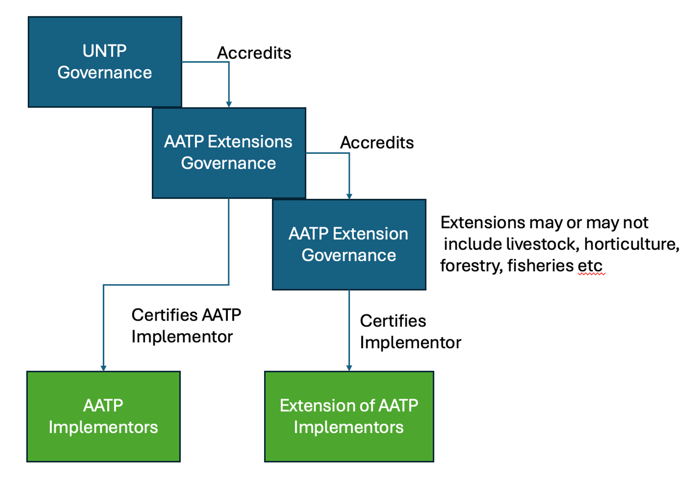
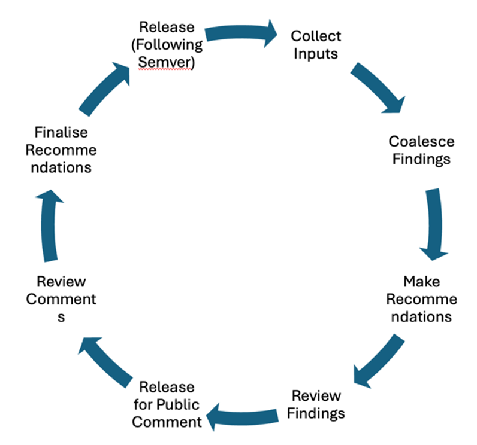

import Disclaimer from '../\_disclaimer.mdx';

<Disclaimer />

# Scope
The scope of AATP is to provide the Australian Agriculture sector the ability to provide high quality, verifiable digital product passports that enable the sector to outcompete on the high quality, clean and green practices that the sector have and continue to develop.  AATP is designed to facilitate adoption of the protocol for all supply chain actors and to ensure that costs and burdens associated with adoption of the protocol continuously decrease over time.  The AATP is an extension of the UNTP and will be updated over time to ensure that it maintains ongoing compliance with UNTP requirements.  
 
# Purpose:
The purpose of the AATP governance group is to support the Australian Agriculture community on their journey to implement UNTP compliant digital product passports at as low cost as possible and facilitate the movement of value of traceabilty to Australias producers.

# Ownership / Authority to Operate
The AATP is operated as a whole of sector protocol and will be authorized and maintained as part of the Department of Agriculture Fisheries and Forestry, Agriculture Trade Group.

# Membership
Membership is based on participation in the agricultural sector, implementation of AATP, and ongoing certification of the implementation of the AATP.

# Roles and Structure
## Roles
•	Secretariat:
•	Primary Producer Representation (ie NFF)
•	RDC Representation
•	Fed Government Representation
•	State Government Representation

# Structure

# Approach and Operations (Secretariat):
The governance function needs to integrate updates and feedback from international and local communities.  On the international side it is important that AATP maintains interoperability with the overall UNTP standards.  From the local side it is important to incorporate feedback from implementors within its scope to facilitate adoption and utility to the local community.  

# The AATP governance must provide the following
1.	Maintain current versions of the AATP standard including tests and validation requirements for implementors
2.	Provide a historical link of all approved standards that have been active at any time
3.	Provide a list implementors that have compliant AATP implementations.
4.	Validation that the AATP maintains interoperability with the UNTP
5.	Provides ongoing advice about AATP version updates, releases, deprecation and sunsetting of versions
6.	Provide implementors and extenders of AATP a forum to incorporate changes into AATP for the benefit of all implementors.
7.	Update AATP regularly to maintain interoperability with UNTP over time
8.	Evaluate and measure adoption, implementation costs and value created to ensure continuous value delivery for the Australian Agriculture community.

 
# Ongoing Governance Process
## Collect Inputs
•	Global (UNTP, Global Market Requirements and Demands, Others?)
•	Regional (Federal (DAFF) and State Regulators, Industry Associations, RDC’s, Others?)
•	Implementors (Farms, Technology Providers, Farm Support Providers, Banks/Finance, Agronomists, Accountants, ESG Consultants)
•	Projects (POC’s, Implementations)

## Process
•	Collect Inputs
•	Coalesce Findings
•	Make recommendations
•	Review Findings
•	Release for Public Comment
•	Review Comments
•	Finalise Recommendations
•	Publish (following SEMVER standards)

## Extension Certification
Provide to the UNTP governance team certification (following UNTP guidance) of the versions of AATP that are approved and active for the Australian Agriculture community.  

## Implementor Certification
Provide to the marketplace certification validation that implementors have implemented the AATP and are issuing AATP compliant certificates.  The manner that this is expected to follow is that the implementer shares a self-issueda verifiable credential following the UNTP valid implementation specification to AATP that provides proof of running the AATP/UNTP test suite and getting a conformant result.  These credentials could then be published so that customers and collaborators can validate the implementation of the implementor.

## Extension Versioning
Extension Compatibility (non-breaking changes) follow “Semantic Versioning”  (SEMVER) to ensure that implementers can confidently select the version of the standard that meets their needs and/or can confidently implement and manage change.

## Tooling
GitHub, Docusauras Website for documentation, Semantic Mapping to accelerate Extensions by RDC’s or other community groups.

# Issue Management & Resolution
TBD

# Sustainability and Funding
TBD

