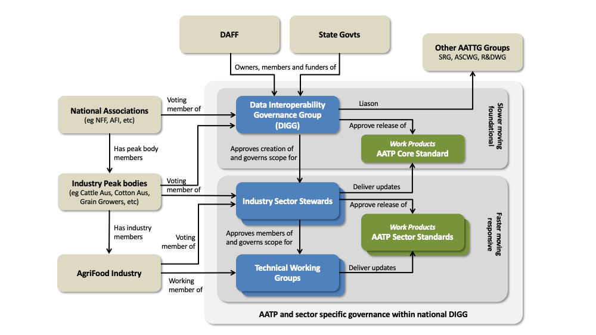
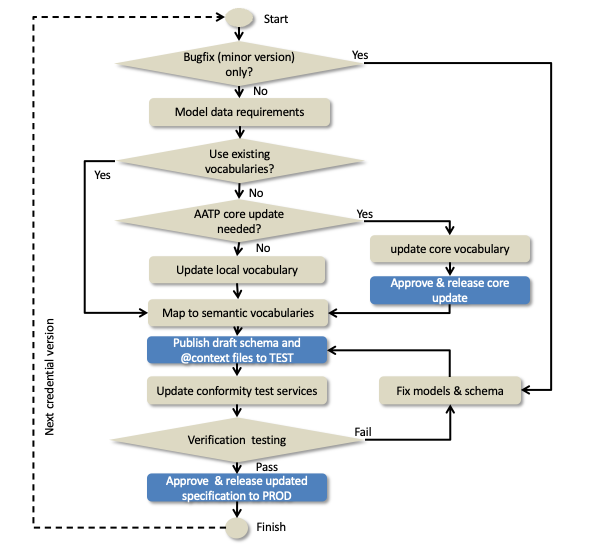
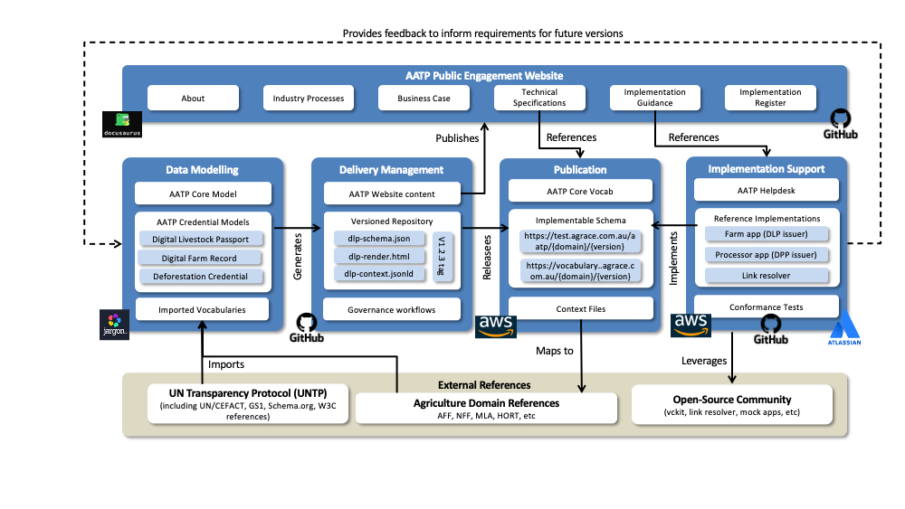

import Disclaimer from '../\_disclaimer.mdx';

<Disclaimer />

A high quality governance framework provides implementers with confidence that AATP

* is a public good that cannot be captured by any specific commercial interest and is free to use without license constraints
* is developed via a consensus based process that ensures it will meet the needs of the Australian Agriculture sector 
* is specific, testable, and rigorously versioned so that implementers can be confident of stability and interoperability
* is compatible with relevant national and international standards and regulations. 

The governance framework described on this page is designed to meet these criteria.  

## Licensing

As required by [UNTP Extensions Governance](https://uncefact.github.io/spec-untp/docs/extensions/ExtensionsMethodology#extension-governance) the AATP is made available under the [Creative Commons 1.0 Universal license](https://creativecommons.org/publicdomain/zero/1.0/?ref=chooser-v1).  This means that it is free to use and can be modified and extended for any purpose. 

## Governance Structure

The AATP is governed under the Australian Agricultural Traceability Governance Group ([AATTG](https://www.agriculture.gov.au/biosecurity-trade/market-access-trade/alliance-2022/australian-agricultural-traceability-governance-group)) within the Data Interoperability Governance Group (DIGG). To ensure that AATG achieves it's purpose, formal liaison with other AATTG groups is required.

* The Strategic Reference Group (SRG) to ensure that AATP continues to meet expectations and aligns with overall AATTG strategy.
* The Assuring Sustainability Claims Working Group (ASCWG) to ensure that AATP conformity claims and credentials meet integrity and conformance requirements.
* The Research and Development Working Group (R&DWG) to ensure that AATP continues to apply best practice technical standards and norms.

The AATP secretariat services, like the DIGG secretariat, are provided by the [Food Agility CRC](https://www.foodagility.com/). 

The AATP recognises that different agricultural sectors will have different requirements for commodity specific data. The bovine characteristics of cattle are of course very different to the product characteristics of grain. Nevertheless there are many common core data elements that can be re-used by each sector. Accordingly AATP defines a common re-usable core (aatp-core) as well as sector specific credentials such as a digital livestock passport. Furthermore, it is important to facilitate agility for sector specific specifications as well as stability for core components. For this reason AATP is governed at two layers that work at different pace.

* Sector specific teams with appropriate industry representation can develop and maintain their sector specific AATP extensions without constraint so long as the extensions apply the AATP extensions methodology and thereby retain cross-sector interoperability.
* From time to time, new common cross-sector needs will be identified that will require an extension to the aatp core standards. These changes are governed by the DIGG and released less frequently.

Membership of the sector specific development teams is determined by the industry associations that are voting members of the sector specific stewards. The sector specific stewards are, in turn appointed by the DIGG under AATTG national rules.

Like any other working group, change is agreed by consensus. Ideally consensus is unanimous within a team but, when there are dissenting votes, a simple majority vote applies. 

## Data Governance Scope

AATP is an extension of UNTP which is itself built on the W3C Verifiable Credentials Data Model (VCDM). Each of these layers define data models and a vocabulary that is protected. This means that UNTP must re-use and not re-define VCDM data elements such as "issuer" (party) and "validFrom" (date). UNTP in turn defines a suite of credential types such as a Digital Product Passport (DPP), Digital Conformity Credential (DCC), Digital Traceability Event (DTE) and Digital Facility Record (DFR) that are all represented as W3C Verifiable Credentials. UNTP is built using data elements defined by UN/CEFACT, Schema.org, GS1 and some global sustainability standards.  

As a conforming UNTP extension, AATP must also re-use and not re-define all UNTP data elements so that AATP credential retain their cross-industry and cross-border interoperability. Therefore the data governance scope of AATP is to define data elements needed for Agricultural traceability and transparency that are not already defined by UNTP. However there are several existing agriculture specific international or national vocabularies such as the [codex alimetarius](https://www.fao.org/fao-who-codexalimentarius/en/) from the UN Food and Agriculture Organisation (FAO) or national standards such as the [bovine language guidelines](https://www.beefcentral.com/wp-content/uploads/2023/02/national-livestock-guidelines-2022-web_final_291122.pdf) from Meat & Livestock Australia. 

As shown in the diagram, a valid AATP credential instance (eg a livestock passport for a specific animal) MUST

* reference and conform to the AATP JSON Schema that defines the **valid data structure**.  The JSON Schema is a complete description of the entire credential and includes all data elements from VCDM, and UNTP, and AATP. It offers a simple and complete schema for implementers to follow.
* reference JSON-LD @context files(s) that map every extended data element to **semantic meaning** defined in an AATP reference vocabulary. JSON-LD @context files are a non-overlapping set of vocabulary mappings and therefore the instance file will reference the VCDM context, and the UNTP context, and the AATP context. 

Consequently the scope of AATP data governance is

* to define data models and JSON schema for AATP credentials as required.
* to select reference vocabularies relevant to the agriculture sector.
* to define a JSON-LD @context file for each AATP credential.
* to maintain an AATP reference vocabulary for all elements that cannot be mapped to an existing standard vocabulary.

## Development Process

All changes to AATP vocabularies, schema, and context files will follow a consistent development process as shown in the workflow diagram below. Each version change follows the entire process but bug fixes can bypass much of the development process. 

The process ensures that no artifacts are released to production unless they are tested and approved. The process also provides for faster releases when there is no requirement to change AATP core vocabularies. 

### Version Management

All AATP artifacts are rigorously versioned following [semver](https://semver.org/) best practices. 

* Version numbers are indicated as a dot-separated triple {major}.{minor}.{patch}.  For example version 2.3.4.
* {patch} version number increments indicate non-breaking bug fixes that do not add new capabilities of features. For example, implementers should see no difference between version 1.4.5 and version 1.4.6.
* {minor} version number increments indicate non-breaking enhancements. For example, implementations of version 1.4.5 are still compatible with version 1.5.0 but may not take advantage of new features.
* {major} version number increments indicate significant and breaking releases. For example implementations of version 1.5.0 will be incompatible with version 2.0.0 and may fail in unpredictable ways.

### Release Management

Every version change is automatically published to the AATP test end point following a defined URL structure

* Structure : `https://test.agtrace.com.au/aatp/{domain}/{version}/{artefact}` 
* Example : `https://test.agtrace.com.au/aatp/livestock/1.2.3/dlp-context.jsonld`

When a given version meets criteria to justify a production release then the governance process will approve a release. Not all versions will be released to production. Production releases will be published as follows.

* Structure : `https://vocabulary.agtrace.com.au/{domain}/{version}/{artefact}`
* Example : `https://vocabulary.agtrace.com.au/livestock/1.2/dlp-context.jsonld`

Allowed domains are `aatp-core`, `livestock`, `horticulture`, `grains`.  More domains may be supported in future.

## Development Tooling

AATP has a complex set of dependencies, includes a rich set of versioned technical artifacts, and must follow a rigorous and collaborative development process. High quality tooling is essential to support AATP governance.  The tooling includes

* **Data Modeling** [Jargon](https://jargon.sh/user/aatp) data modeling tool provides business domain expert in AATP development working groups and teams with a tool for developing logical data models and vocabularies that requires relatively little technical expertise. Complex physical artifacts such as JSON schema, JSON-LD context files, and RDF vocabularies are all generated from the Jargon tool using built-in transformation rules. Jargon also provides an easy way to map AATP models to existing external vocabularies.
* **Delivery Management** [GitHub](https://github.com/FACRC-AgTrace/AATP) is the worlds most popular open source development platform. It provides version controlled content management, project management, release workflows, and many more features.  It is at the heart of AATP governance. Jargon generated artifacts such as livestock passport schema are pushed to GitHub and then GitHub release workflows are used to publish the AATP artifacts.
* **Publication** Modern digital standards including all data element definitions must be published to permanent and highly available web locations. The Amazon Cloud [S3 Service](https://aws.amazon.com/s3/) provides an effective and low cost solution which is also used by the UNTP.  GitHub workflows will automatically publish new releases to AATP test and/or production hosting locations.
* **Implementation Support** requires a help-desk management system (implemented using [Jira](https://www.atlassian.com/software/jira)) as well as a suite of references implementations and test services - which are built from open source code in GitHub and deployed to Amazon infrastructure. Feedback and experience from actual implementations provide valuable input to close the loop back to the start for the next release of AATP.
* **AATP Public Engagement** is achieved using a website that is generated from content management in GitHub and presented for easy navigation using [docusaurus](https://docusaurus.io/)

This collection of tooling provides AATP with a low cost and highly effective mechanism for long term governance.  

