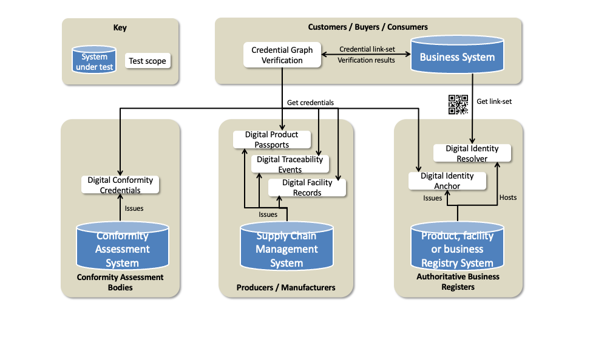
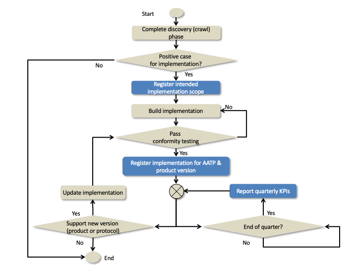

import Disclaimer from '../\_disclaimer.mdx';

<Disclaimer />

## Implementation Conformity Scope

Governance applies not only to the development of AATP itself but also to the ecosystem of AATP implementers. A Livestock passport issued from a farm system should be discoverable and readable by a processor system without any specific system to system testing. To achieve such interoperability, AATP must provide a comprehensive conformity testing service that can provide confidence that, once any system has successfully completed testing, it will produce artifacts that are interoperable with any other system. 

Interoperability depends not only on well tested conformant implementations but also only alignment in the scope of what has been implemented. There are several AATP credential types and each may transition through multiple major versions. Maximum interoperability is achieved when both an issuing system and a verifier system support the same credential type major version - such as a digital livestock passport v1.0. However, even when two implementers do not support the same credential type & version, there are still some valuable fallback:

* if both credentials (eg livestock passport v2 and horticulture passport v1) are built on the same underlying UNTP credential such as the digital product passport v1 - then there will still be a useful level of interoperability even if the specific extended attributes are not processable.
* even when a verifier party has zero technical implementation or total misalignment between technical implementations, the credentials are still human readable and so can still be manually processed. 

The diagram shows the different role types in a typical AATP implementation and which credential types they would be likely to implement. There are four roles.

* The conformity assessment body (CAB) is the simplest one. A CAB issues credentials such as emissions or deforestation credentials to producers or manufacturers.  There is likely to be a wide variety of conformity credential types but all will follow the same interoperable UNTP Digital Conformity Credential core. The conformity credentials are issued to producers or manufacturers who may publish them together with their own issued credentials.
* Registry operators will issue identity credentials to their members (typically the producers and manufacturers) in much the same way that CABs issue conformity credentials. Registry operators must also operate a link resolver service which, given a registered identifier (eg a GTIN) will return a list of links to further information about the identifier.  The links may point to data hosted by the register but more often will redirect to data (such as digital passports) hosted by the producer / manufacturer.
* Producers and manufacturers (processors) are issuers of product credentials, facility credentials, and traceability events. These credentials should also be published and linked to the corresponding product or facility identifiers (eg NLIS or PIC) using a link resolver service. The conformity credentials and identity credentials provided by CABs and registers may also be published and linked to the same product or facility identifiers.
* Finally verifiers will resolve product and facility identifiers to retrieve a bundle of related credentials and then will verify the collection of related credentials against a set of business rules. Some of the business rules will be common across all verifiers and therefore may be bundled as AATP standard executable rules.

## Implementation Conformity Process

Implementers will follow a structured process to achieve and maintain AATP conformance - as indicated in the workflow diagram below and described in detail in the [implementation guidance](../tools-and-support) pages.

* Once satisfied that there is a positive case for implementation (please refer to the [business case](../business-case) section of this website) then implementers are encouraged to publish their intent to implement the AATP following the process outlined in the [implementation register](../implementations).
* Once an implementation has completed build and has passed [conformity testing](../tools-and-support/TestService.md) then the implementer should update their entry on the AATP implementers register accordingly. At this point the maintenance life-cycle commences which includes
  * Re-testing and updating the implementation register when either the implementer software product major version or supported AATP credential major/minor version changes.
  * providing simple high-level and de-personalised quarterly reports to the AATP secretariat against KPIs defined in the [value assessment](../business-case/ValueAssessment.md) page. 

## Testing Overview

