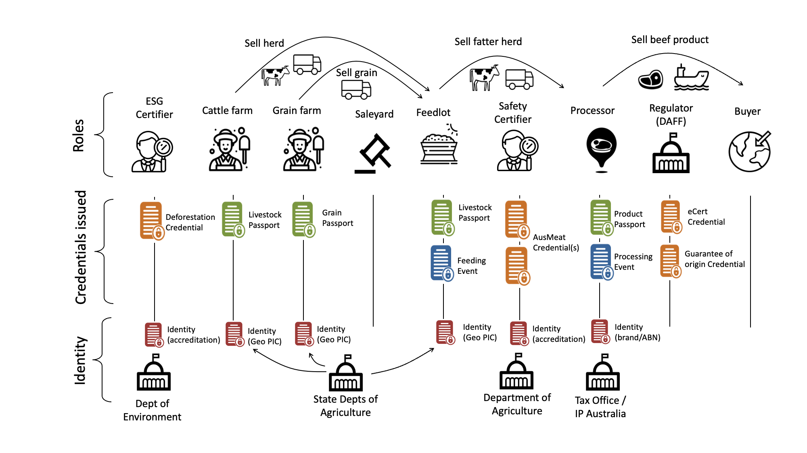

import Disclaimer from '../\_disclaimer.mdx';

<Disclaimer />

## Livestock Value Chain

The livestock value chain shown below indicates which role(s) are expected to **issue** which AATP credential types. 

Any actor that has an identifier of a cattle, facility, or organisation can find the issued credentials and verify them.  In general, downstream actors will be verifiers of upstream credentials. 

## Implementation Guidance

Each implementer role should follow links to the relevant credential specifications and ensure that they are issuing credentials according to the relevant specification. In most cases the technical implementation will be done by underlying [software](../register/Software) systems. However it is still important that each actor confirm that the AATP credentials issued by their chosen systems are valid by dropping them into the [conformity testing](ConformityTesting) service. 

|Role|Issuer of|Comments|
|--|--|--|
|ESG Certifier|[Deforestation Credential](../specification/ConformityCredential#deforestation-credential)|Note that the deforestation credential subject will be the PIC of the farm and not the NLIS of the animal. Traceability from animal to farm is possible because the livestock passport includes the PIC of the farm. |
|Livestock Farm|[Livestock Passport](../specification/DigitalProductPassport#digital-livestock-passport-dlp)|Note that farmers that do not already have AATP compatible software systems may choose to delegate the authority to issue livestock passports to the feedlot or processor to which they sell the cattle. |
|Grain Farm|[Grain Passport](..//specification/DigitalProductPassport#digital-grains-passport)| |
|Sale-yard|None|Sale-yards have no impact on ESG or safety qualities and so need not issue any credentials|
|Feedlot|[Livestock Passport](../specification/DigitalProductPassport#digital-livestock-passport-dlp) and [Feeding Event](../specification/DigitalTraceabilityEvent#animal-feeding-event)| Accredited feedlots should link a new post-feeding Livestock Passport to the NLIS ID of the animal|
|Safety Certifier|AUSMeat credentials be defined|Safety credentials include AusMeat accreditation for abattoirs, AAWCS (welfare) certification, and many others. Credentials are typically issued to establishments identified by PICs. Digital mappings to AATP conformity credentials are not yet defined. However the holder of credentials are encouraged to make them discoverable via PIC link resolvers|
|Processor| [Processed Meat Passport](h../specification/DigitalProductPassport#processed-meat-passport) and [Animal Processing Event](../specification/DigitalTraceabilityEvent#animal-processing-event)| The animal processing event represents a processed batch of animals and provides the essential connection from packaged meat product back to the batch from which it was derived|
|Regulator (DAFF)|Export eCert and Guarantee of Origin|AATP mapping for regulatory credentials is not yet defined. Issuing eCerts as human and machine readable AATP Conformity Credentials would allow both intermediaries and competent authorities in export markets to verify compliance. A future avenue to further uplift the export market value of Australian produce would be to issue guarantee of origin credentials that attest to the collection of domestic certifications (eg deforestation, carbon intensity, etc). |

## Identity Anchors

Identity anchors add increased trust to the AATP ecosystem because they link the DIDs (Self-issued IDs) of actors such as farms, feedlots, processors etc to authoritative registers such as PIC registers, the ABR, or GS1 customer keys. They are very simple credentials and are simple to issue. Their purpose and detailed implementation guidance are provided in the UNTP [Digital Identity Anchor (DIA)](https://uncefact.github.io/spec-untp/docs/specification/DigitalIdentityAnchor) specification.  The DIA is mapped to AATP identifiers in the [Identifiers](../specification/Identifiers) section of this website. The table below lists the specific identity anchors relevant for actors in the livestock industry. Each actor SHOULD request the corresponding identity credential from their registrar and should make it discoverable by 

* linking it to their DID `serviceEndpoint` as described in [DIA DID discovery](https://uncefact.github.io/spec-untp/docs/specification/DigitalIdentityAnchor#via-did-service-endpoint)
* adding it to their registry entry as a link type as described in [DIA Resolver Discovery](https://uncefact.github.io/spec-untp/docs/specification/DigitalIdentityAnchor#via-identity-resolver)

These tasks will normally be facilitated by the registrar such as the NLIS, State PIC register, ABR, and GS1. 

|Role|Identity Anchor Type|Comment|
|--|--|--|
| | | |

## Buyers (Retailers & Brands)

TBD

