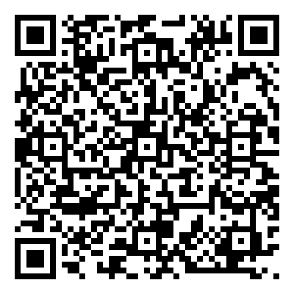

The AATP Deforestation Credential is designed to provide a high integrity attestation of the deforestation status of an Australian farm (aka Facility). The attestation is designed to met the requirements of the [EU Deforestation Regulation (EUDR)](https://environment.ec.europa.eu/topics/forests/deforestation/regulation-deforestation-free-products_en) as well as provide high confidence due diligence for any global food brand that wishes to confidently attach deforestation free claims to their food products.

### Deforestation Credential Example

### Logical Model

The Deforestation Credential leverages the [UNTP Digital Conformity Credential](https://uncefact.github.io/spec-untp/docs/specification/ConformityCredential) v 0.5.0 logical model without change.

### Profile Rules

* `ConformityAssessment.assessedProduct` is not required.
* `ConformityAssessment.assessedFacility` is mandatory and MUST reference the Farm [PIC (Property Identification Code)](Identifiers#property-identification-codes-pic).
* `ConformityAssessment.assessedOrganisation` SHOULD be included and reference the farm owner or operator using the [ABN identity scheme](Identifiers#australian-business-number-abn)
* `ConformityAttestation.authorisation` SHOULD be included and reference (via `Endorsement.issuingAuthority` an accreditation trust anchor in the `.gov.au` domain.
* `ConformityAttestation.auditableEvidence` (eg satellite imagery) that informed the assessment SHOULD be included and MAY be encrypted via the `untp.SecureLink` object.
* `Claim.assessmentCriteria` MUST be drawn from the allowed [vocabularies](vocabularies) for deforestation criteria.

### Technical Artifacts

Implementers must use the [UNTP DCC Technical Artifacts](https://test.uncefact.org/vocabulary/untp/dcc/0/about).  v0.5.0

### Working Sample

| Clickable Link                                                                                                                | Scan the QR                                                               | Comments                                                                                                                                                        |
| ----------------------------------------------------------------------------------------------------------------------------- | ------------------------------------------------------------------------- | --------------------------------------------------------------------------------------------------------------------------------------------------------------- |
| [Deforestation Conformity Credential](https://idr.aatp.showthething.com/dpird/pic/QBIX0987/?linkType=dpird:certificationInfo) |  | Sample EUDR conformity credential. Click on the JSON tab to see the underling AATP data. Download the signed credential to test verification in your own system |
