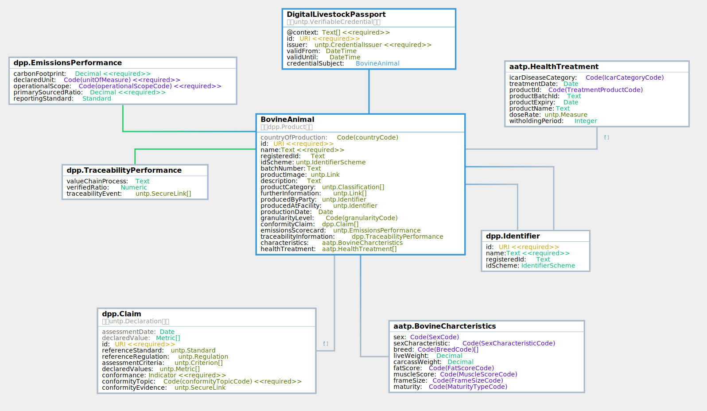

import CredentialViewer from '../../src/components/CredentialViewer';

The AATP Digital Livestock Passport (DLP) adds Bovine characteristics and animal health treatment records based on the Meat and Livestock Australia (MLA) [national bovine livestock language guidelines](https://www.ausmeat.com.au/media/1521/mla-national-livestock-guidelines-2022-web_final_291122.pdf).

<CredentialViewer src="/samples/dlp-sample.json" />

### Logical Model

The key information components of the DLP are shown in the logical model diagram.  The data model is identical to the [UNTP Digital Product Passport](https://uncefact.github.io/spec-untp/docs/specification/DigitalProductPassport) - [version v0.5.0](https://jargon.sh/user/unece/DigitalProductPassport/v/0.5.0) with the following changes

* Added `BovineCharacteristics` according to [MLA](https://www.mla.com.au/) guidelines.
* Added `HealthTreatments` according to [APVMA](https://www.apvma.gov.au/) guidelines.
* Removed `CircularityScorecard` because it is not relevant to livestock.
* Removed `MaterialsProvenance` because it is not relevant to livestock.

Browse the [classes, properties, and code-lists used in the DLP](https://jargon.sh/user/aatp/DigitalLivestockPassport/v/0.4.0/artefacts/readme/render).  

### Profile Rules

* `BovineAnimal.Id` (and related `schemeId` and `registeredId`) MUST be drawn from the [NLIS identifier scheme](/docs/specification/Identifiers#national-livestock-identifier-scheme-nlis) - for example `https://nlis.com.au/QDBH0132XBS01234`
* `BovineAnimal.productCategory` SHOULD use the UN CPC schemeID `https://unstats.un.org/unsd/classifications/Econ/cpc` with `"code:""02111"` and `"name":"Bovine animals, live"`
* `BovineAnimal.producedByParty` MUST identify the owner or operator of the birth farm using the [ABN identifier scheme](/docs/specification/Identifiers#australian-business-number-abn).
* `BovineAnimal.producedAtFacility` MUST identify the PIC of the birth farm, using the relevant state register [PIC identifier scheme](/docs/specification/Identifiers#property-identification-codes-pic).
* `Claim.assessmentCriteria` MUST be drawn from the allowed [vocabularies](/docs/specification/Vocabularies)

### Technical Artifacts

The following technical artifacts are for use by DLP implementers.

* [JSON Schema](../../schema/aatp-dlp-schema-0.4.0.json)
* [JSON-LD @context file](../../schema/aatp-dlp-context-0.4.0.jsonld)
* [JSON sample instance](https://jargon.sh/user/aatp/DigitalLivestockPassport/v/0.4.0/artefacts/jsonSchemas/DigitalLivestockPassport_instance.json?class=DigitalLivestockPassport_instance)

### Working Sample

| Clickable Link                                                                                                 | Scan the QR                                                                      | Comments                                                                                                                                                 |
| -------------------------------------------------------------------------------------------------------------- | -------------------------------------------------------------------------------- | -------------------------------------------------------------------------------------------------------------------------------------------------------- |
| [Digital Livestock Passport Verifiable Credential](https://idr.aatp.showthething.com/nlis/01/QDBH0132XBS01234) |  | Sample grass fed Angus DLP. Click on the JSON tab to see the underling AATP data. Download the signed credential to test verification in your own system |
