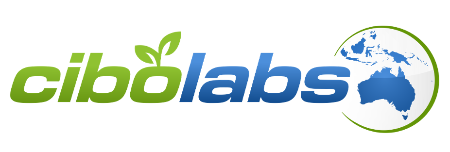
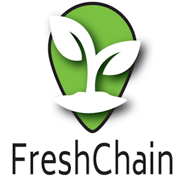

Please refer to [Implementation Register](index.md) for general information about the purpose, scope, and process of registering AATP implementations.

## Implementation Register

Summary list of software products and status of implementation. Scope defines the list of AATP specifications supported.

| Organisation Name                                                 | Product Name                             | AATP Scope                                  | Status    |
| ----------------------------------------------------------------- | ---------------------------------------- | ------------------------------------------- | --------- |
| [CIBO Labs](#cibo-labs)                                           | Farm Reports                       | VCP, DCC, DFR                     |testing|
| [Trust Provenance](#trust-provenance)                             | Trust Provenance                         | VCP, DPP, DTE, DCC, DFR | testing|
| [FreshChain](#freshchain)                                         | FreshChain Platform                      | VCP, DPP, DFR, DTE, DCC          | testing  |

## Implementation Details

### [CIBO Labs](https://www.cibolabs.com.au/)

- AATP commitment made on: 11-Sept-2024
- Registration Country: Australia
- Operating Countries: Australia

| Logo                                                          | Implementation Statement                                                                                                                                                                                                                                                                                                                                                                                                                                                                                                                                                                                                 |
| ------------------------------------------------------------- | ------------------------------------------------------------------------------------------------------------------------------------------------------------------------------------------------------------------------------------------------------------------------------------------------------------------------------------------------------------------------------------------------------------------------------------------------------------------------------------------------------------------------------------------------------------------------------------------------------------------------ |
|  | Cibo Labs Pty Ltd is an agricultural data analytics company that is encompassing world-leading science, empowering profitable farms, and fostering sustainable landscapes through innovative and high-quality solutions. AATP provides a means for us to empower our customers with high integroty proof of their credentials such as deforestation that can be trusted by customers and regulators in any market.|

** Product Information **

| Product Name & version             | Description                    | AATP Scope & versions        | Implementation Test Report |
| ---------------------------------- | ------------------------------ | ---------------------------- | -------------------------- | --- |
| [Farm Reports](https://www.cibolabs.com.au/products/reports//) | Digital Conformity Credential (Deforestation) | VCP, DCC, DFR v1.0 | |                   | TBA |

### [Trust Provenance](https://trustprovenance.com/)

- AATP commitment made on: 11-Sept-2024
- Registration Country: Australia
- Operating Countries: Global

| Logo                                                           | Implementation Statement                                                                                                                                                                                                                                                                                                                                                                                                                                                                                                                                                                                                                                                                                                                                                                                                                                                                                                                                                                                                                                                                                                                                                                                                                                  |
| -------------------------------------------------------------- | --------------------------------------------------------------------------------------------------------------------------------------------------------------------------------------------------------------------------------------------------------------------------------------------------------------------------------------------------------------------------------------------------------------------------------------------------------------------------------------------------------------------------------------------------------------------------------------------------------------------------------------------------------------------------------------------------------------------------------------------------------------------------------------------------------------------------------------------------------------------------------------------------------------------------------------------------------------------------------------------------------------------------------------------------------------------------------------------------------------------------------------------------------------------------------------------------------------------------------------------------------- |
|  | The United Nations Transparency Protocol (UNTP) is crucial for Trust Provenance as it aligns with the company's mission to foster transparency and traceability in Australian agriculture. The UNTP provides a standardized framework for managing and sharing data across global supply chains, ensuring that the origins, production practices, and environmental impact of agricultural products are verifiable. For Trust Provenance, which focuses on ensuring trust and integrity in supply chains, this protocol offers a way to standardize how data related to sustainability, compliance, and traceability are captured and communicated. In Australian agriculture, where sustainability and transparency are increasingly essential to meet domestic and international market demands, the UNTP ensures that producers, regulators, and consumers have confidence in the provenance and sustainability of agricultural products. By adopting the UNTP protocol, Trust Provenance can streamline its efforts to manage digital product passports, ensuring that Australian farmers can provide credible, traceable, and verifiable data that meets global standards, bolstering both the local industry and its international competitiveness. |

** Product Information **

| Product Name & version                           | Description                                    | UNTP Scope & versions                     | Implementation Test Report |
| ------------------------------------------------ | ---------------------------------------------- | ----------------------------------------- | -------------------------- |
| [Trust Provenance](https://trustprovenance.com/) | Supply chain traceability & transparency suite | VCP, DPP, DTE, DFR, IDR, DAC all versions | TBA                        |

### [FreshChain](https://freshchain.com.au/)

- AATP commitment made on: 12-Sept-2024
- Registration Country: Australia
- Operating Countries: Global
- Participate in pre-release UNTP Pilots? : Yes

| Logo                                                      | Implementation Statement                                                                                                                                                                                                                                                                                                                                                                                                                                                                                                                                                                                               |
| --------------------------------------------------------- | ---------------------------------------------------------------------------------------------------------------------------------------------------------------------------------------------------------------------------------------------------------------------------------------------------------------------------------------------------------------------------------------------------------------------------------------------------------------------------------------------------------------------------------------------------------------------------------------------------------------------- |
|  | FreshChain is a fully integrated, blockchain enabled, paddock to plate assurance system that verifies the food you eat. It uses artificial intelligence, machine learning and deep learning algorithms to trace and monitor products throughout the supply chain. The protocol supports our values of ensuring that food is safe, secure, and sustainable. It enables quality data sharing that streamlines ESG responsibilities and assists with market access. UNTP is an important implementable standard for FreshChain to empower our customers to connect into global transparent and sustainable supply chains. |

** Product Information **

| Product Name & version                            | Description                    | UNTP Scope & versions                        | Implementation Test Report |
| ------------------------------------------------- | ------------------------------ | -------------------------------------------- | -------------------------- |
| [FreshChain Platform](https://freshchain.com.au/) | traceability from farm to fork | VCP, DPP, DCC, DTE, IDR, DIA, DAC v0.5, v1.0 | TBA                        |

** Industry Focus **

| Industry Sector | Process focus                               | UNTP Usage |
| --------------- | ------------------------------------------- | ---------- |
| Agriculture     | Horticulture food safety, export compliance | DPP, DCC   |

