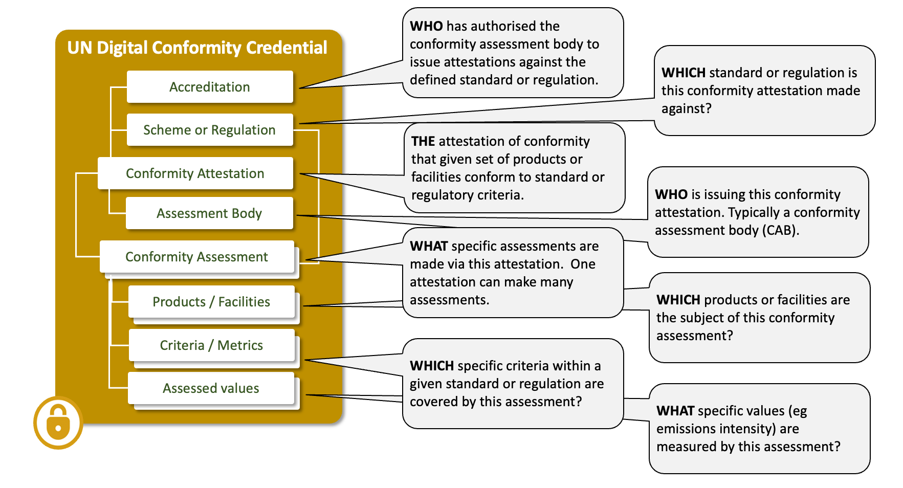
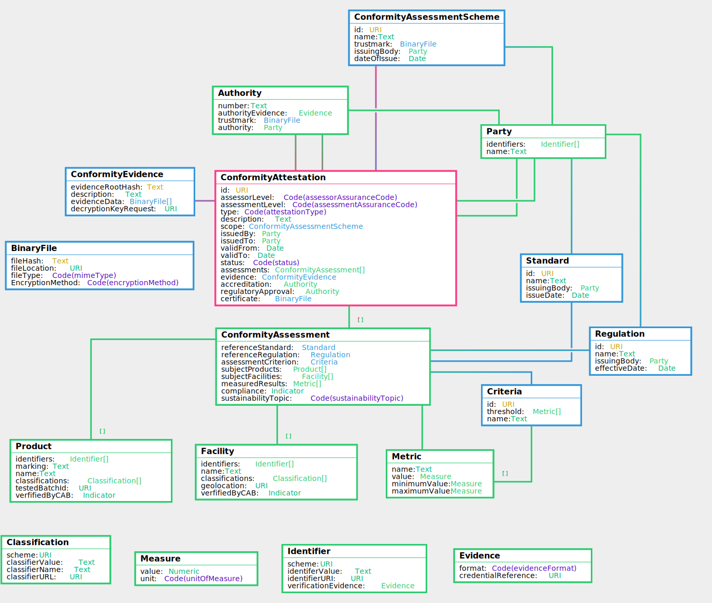

import Disclaimer from '../\_disclaimer.mdx';

<Disclaimer />

## Versions

|DPCC Version|Date|status|JSON-LD Context|JSON Schema|
|--|--|--|--|
| | | | |


## Overview

Conformity credentials are usually issued by independent third parties and provide a **trusted assessment** of product ESG performance against credible **standards or regulations**. As such the credential provides trusted verification of the ESG claims in the passport. Since the passport may make several independent claims (eg emissions intensity, deforestation free, fair work, etc) there may be many linked conformity credentials referenced by one passport. As an additional trust layer, the conformity credential may reference an **accreditation** credential that attests to the authority of the third party to perform the specific ESG assessments.

## Conceptual Model



## Requirements

The digital product conformity credential (DPCC) is designed to meet the following detailed requirements as well as the more general [UNTP Requirements(https://uncefact.github.io/spec-untp/docs/about/Requirements)]

|ID|Name|Requirement Statement|Solution Mapping|
|--|--|--|--|
| | | |

## Logical Model

The UNTP logical model upon which AATP industry extensions are based.




## Deforestation Credential

## Water Usage Credential

## Emissions Intensity Credential


## Sample

```
{
  "id": "http://example.com",
  "assessorLevel": "Self",
  "assessmentLevel": "GovtApproval",
  "type": "certification",
  "description": "string",
  "scope": {
    "id": "http://example.com",
    "name": "string",
    "trustmark": {
      "fileHash": "string",
      "fileLocation": "http://example.com",
      "fileType": "string",
      "EncryptionMethod": "none"
    },
    "issuingBody": {
      "identifiers": [
        {
          "scheme": "http://example.com",
          "identiferValue": "string",
          "identifierURI": "http://example.com",
          "verificationEvidence": {
            "format": "w3c_vc",
            "credentialReference": "http://example.com"
          }
        }
      ],
      "name": "string"
    },
    "dateOfIssue": "2019-08-24"
  },
  "issuedBy": {
    "identifiers": [
      {
        "scheme": "http://example.com",
        "identiferValue": "string",
        "identifierURI": "http://example.com",
        "verificationEvidence": {
          "format": "w3c_vc",
          "credentialReference": "http://example.com"
        }
      }
    ],
    "name": "string"
  },
  "issuedTo": {
    "identifiers": [
      {
        "scheme": "http://example.com",
        "identiferValue": "string",
        "identifierURI": "http://example.com",
        "verificationEvidence": {
          "format": "w3c_vc",
          "credentialReference": "http://example.com"
        }
      }
    ],
    "name": "string"
  },
  "validFrom": "2019-08-24",
  "validTo": "2019-08-24",
  "status": "string",
  "assessments": [
    {
      "referenceStandard": {
        "id": "http://example.com",
        "name": "string",
        "issuingBody": {
          "identifiers": [
            {
              "scheme": "http://example.com",
              "identiferValue": "string",
              "identifierURI": "http://example.com",
              "verificationEvidence": {
                "format": "w3c_vc",
                "credentialReference": "http://example.com"
              }
            }
          ],
          "name": "string"
        },
        "issueDate": "2019-08-24"
      },
      "referenceRegulation": {
        "id": "http://example.com",
        "name": "string",
        "issuingBody": {
          "identifiers": [
            {
              "scheme": "http://example.com",
              "identiferValue": "string",
              "identifierURI": "http://example.com",
              "verificationEvidence": {
                "format": "w3c_vc",
                "credentialReference": "http://example.com"
              }
            }
          ],
          "name": "string"
        },
        "effectiveDate": "2019-08-24"
      },
      "assessmentCriterion": {
        "id": "http://example.com",
        "threshold": [
          {
            "name": "string",
            "value": {
              "value": 0,
              "unit": "string"
            },
            "minimumValue": {
              "value": 0,
              "unit": "string"
            },
            "maximumValue": {
              "value": 0,
              "unit": "string"
            }
          }
        ],
        "name": "string"
      },
      "subjectProducts": [
        {
          "identifiers": [
            {
              "scheme": "http://example.com",
              "identiferValue": "string",
              "identifierURI": "http://example.com",
              "verificationEvidence": {
                "format": "w3c_vc",
                "credentialReference": "http://example.com"
              }
            }
          ],
          "marking": "string",
          "name": "string",
          "classifications": [
            {
              "scheme": "http://example.com",
              "classifierValue": "string",
              "classifierName": "string",
              "classifierURL": "http://example.com"
            }
          ],
          "testedBatchId": "http://example.com",
          "verfifiedByCAB": true
        }
      ],
      "subjectFacilities": [
        {
          "identifiers": [
            {
              "scheme": "http://example.com",
              "identiferValue": "string",
              "identifierURI": "http://example.com",
              "verificationEvidence": {
                "format": "w3c_vc",
                "credentialReference": "http://example.com"
              }
            }
          ],
          "name": "string",
          "classifications": [
            {
              "scheme": "http://example.com",
              "classifierValue": "string",
              "classifierName": "string",
              "classifierURL": "http://example.com"
            }
          ],
          "geolocation": "http://example.com",
          "verfifiedByCAB": true
        }
      ],
      "measuredResults": [
        {
          "name": "string",
          "value": {
            "value": 0,
            "unit": "string"
          },
          "minimumValue": {
            "value": 0,
            "unit": "string"
          },
          "maximumValue": {
            "value": 0,
            "unit": "string"
          }
        }
      ],
      "compliance": true,
      "sustainabilityTopic": "environment.energy"
    }
  ],
  "evidence": {
    "evidenceRootHash": "string",
    "description": "string",
    "evidenceData": [
      {
        "fileHash": "string",
        "fileLocation": "http://example.com",
        "fileType": "string",
        "EncryptionMethod": "none"
      }
    ],
    "decryptionKeyRequest": "http://example.com"
  },
  "accreditation": {
    "number": "string",
    "authorityEvidence": {
      "format": "w3c_vc",
      "credentialReference": "http://example.com"
    },
    "trustmark": {
      "fileHash": "string",
      "fileLocation": "http://example.com",
      "fileType": "string",
      "EncryptionMethod": "none"
    },
    "authority": {
      "identifiers": [
        {
          "scheme": "http://example.com",
          "identiferValue": "string",
          "identifierURI": "http://example.com",
          "verificationEvidence": {
            "format": "w3c_vc",
            "credentialReference": "http://example.com"
          }
        }
      ],
      "name": "string"
    }
  },
  "regulatoryApproval": {
    "number": "string",
    "authorityEvidence": {
      "format": "w3c_vc",
      "credentialReference": "http://example.com"
    },
    "trustmark": {
      "fileHash": "string",
      "fileLocation": "http://example.com",
      "fileType": "string",
      "EncryptionMethod": "none"
    },
    "authority": {
      "identifiers": [
        {
          "scheme": "http://example.com",
          "identiferValue": "string",
          "identifierURI": "http://example.com",
          "verificationEvidence": {
            "format": "w3c_vc",
            "credentialReference": "http://example.com"
          }
        }
      ],
      "name": "string"
    }
  },
  "certificate": {
    "fileHash": "string",
    "fileLocation": "http://example.com",
    "fileType": "string",
    "EncryptionMethod": "none"
  }
}
```


