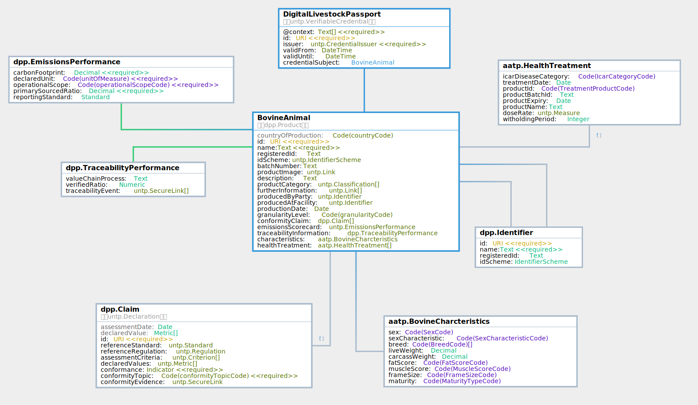

import Disclaimer from '../\_disclaimer.mdx';

<Disclaimer />

## Digital Product Passports

The AATP digital product passports are all commodity-specific extensions of the [UNTP Digital Product Passport](https://uncefact.github.io/spec-untp/docs/specification/DigitalProductPassport). Implementers should familiarise with the UNTP DPP before implementing this AATP Livestock passport specification.

The table lists each AATP product passport type and version as well as it's UNTP version dependency.

| Name | Current Version |Status| Release Date | UNTP dependency |
| --- | ---- | ------ | --- | --- | 
| [Digital Livestock Passport](#digital-livestock-passport-dlp)|  0.4.0| Draft| 20-11-2024 |UNTP DPP v0.5.0|
| [Processed Meat Passport](#processed-meat-passport)|  0.4.0| Draft| 20-11-2024 |UNTP DPP v0.5.0|
| [Horticulture Passport](#digital-horticulture-passport)|  0.4.0| Draft| 20-11-2024 |UNTP DPP v0.5.0|
| [Grains Passport](#digital-grains-passport)|  0.4.0| Draft| 20-11-2024 |UNTP DPP v0.5.0|

## Digital Livestock Passport (DLP)

The AATP Digital Livestock Passport (DLP) adds Bovine characteristics and animal health treatment records based on the Meat and Livestock Australia (MLA) [national bovine livestock language guidelines](https://www.ausmeat.com.au/media/1521/mla-national-livestock-guidelines-2022-web_final_291122.pdf).

### Logical Model

The key information components of the DLP are shown in the logical model diagram.  The data model is identical to the [UNTP Digital Product Passport](https://uncefact.github.io/spec-untp/docs/specification/DigitalProductPassport) - [version v0.5.0](https://jargon.sh/user/unece/DigitalProductPassport/v/0.5.0) with the following changes

* Added `BovineCharacteristics` according to [MLA](https://www.mla.com.au/) guidelines.
* Added `HealthTreatments` according to [APVMA](https://www.apvma.gov.au/) guidelines.
* Removed `CircularityScorecard` because it is not relevant to livestock.
* Removed `MaterialsProvenance` because it is not relevant to livestock.

Browse the [classes, properties, and code-lists used in the DLP](https://jargon.sh/user/aatp/DigitalLivestockPassport/v/0.4.0/artefacts/readme/render).  

### Profile Rules

* `BovineAnimal.Id` (and related `schemeId` and `registeredId`) MUST be drawn from the [NLIS identifier scheme](Identifiers#national-livestock-identifier-scheme-nlis) - for example `https://nlis.com.au/QDBH0132XBS01234`
* `BovineAnimal.productCategory` SHOULD use the UN CPC schemeID `https://unstats.un.org/unsd/classifications/Econ/cpc` with `"code:""02111"` and `"name":"Bovine animals, live"`
* `BovineAnimal.producedByParty` MUST identifiy the owner or operator of the birth farm using the [ABN identifier scheme](Identifiers#australian-business-number-abn).
* `BovineAnimal.producedAtFacility` MUST identify the PIC of the birth farm, using the relevant state register [PIC identifier scheme](Identifiers#property-identification-codes-pic).
* `Claim.assessmentCriteria` MUST be drawn from the allowed [vocabularies](Vocabularies.md)

### Technical Artifacts

The following technical artifacts are for use by DLP implementers.

* [JSON Schema](https://jargon.sh/user/aatp/DigitalLivestockPassport/v/0.4.0/artefacts/jsonSchemas/DigitalLivestockPassport.json?class=DigitalLivestockPassport)
* [JSON-LD @context file](https://jargon.sh/user/aatp/DigitalLivestockPassport/v/0.4.0/artefacts/jsonldContexts/DigitalLivestockPassport.jsonld?class=DigitalLivestockPassport)
* [JSON sample instance](https://jargon.sh/user/aatp/DigitalLivestockPassport/v/0.4.0/artefacts/jsonSchemas/DigitalLivestockPassport_instance.json?class=DigitalLivestockPassport_instance)

### Working Sample

An issued Digital Livestock Passport Verifiable Credential (link TBD)

## Processed Meat Passport

TBD

## Digital Horticulture Passport

TBD

## Digital Grains Passport

TBD