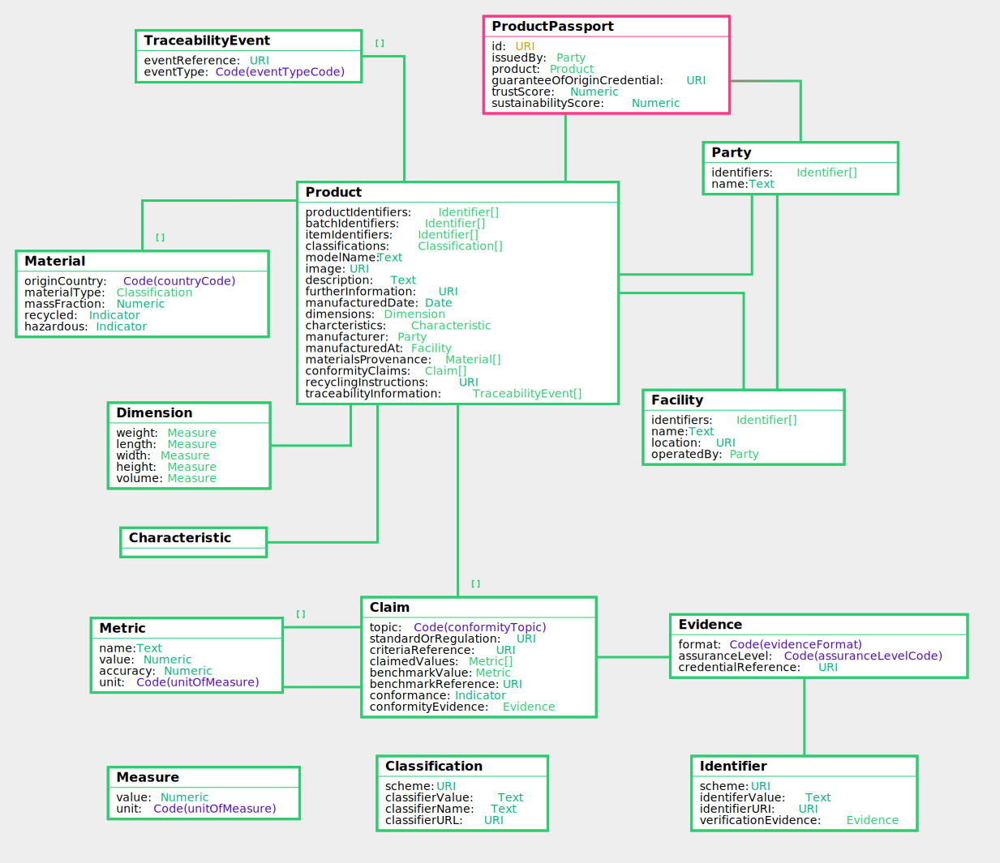

import Disclaimer from '../\_disclaimer.mdx';

<Disclaimer />

## Versions

| DPP Version | Date | status | JSON-LD Context | JSON Schema |
| ----------- | ---- | ------ | --------------- | ----------- |
|             |      |        |                 |

## Overview

The digital product passport (DPP) is issued by the shipper of goods and is the carrier of **product and sustainability information** for every serialised product item (or product batch) that is shipped between actors in the value chain. It is deliberately **simple and lightweight** and is designed to carry the minimum necessary data at the **granularity** needed by the receiver of goods - such as the scope 3 emissions in a product shipment. The passport contains links to **conformity credentials** which add trust to the ESG claims in the passport. The passport also contains links to **traceability events** which provide the "glue" to follow the linked-data trail (subject to confidentiality constraints) from finished product back to raw materials. The UNTP DPP does not conflict with national regulations such as the EU DPP. In fact, it can usefully be conceptualised as the **upstream B2B feedstock** that provides the data and evidence needed for the issuing of high quality national level product passports.

## Conceptual Model


## Requirements

The digital product passport is designed to meet the following detailed requirements as well as the more general [UNTP Requirements](https://uncefact.github.io/spec-untp/docs/about/Requirements)

| ID  | Name | Requirement Statement | Solution Mapping |
| --- | ---- | --------------------- | ---------------- |

## Logical Model

The UNTP logical model upon which the industry extensions are based.



## Livestock Extensions

## Horticulture Extensions

## Grains Extensions

## Sample

Note - this sample describes the digital product passport payload only - ie the subject of the verifiable credetial without the envelope. Needs some more realistic data.

```
{
  "id": "http://example.com",
  "issuedBy": {
    "identifiers": [
      {
        "scheme": "http://example.com",
        "identiferValue": "string",
        "identifierURI": "http://example.com",
        "verificationEvidence": {
          "format": "w3c_vc",
          "assuranceLevel": "Self",
          "credentialReference": "http://example.com"
        }
      }
    ],
    "name": "string"
  },
  "product": {
    "productIdentifiers": [
      {
        "scheme": "http://example.com",
        "identiferValue": "string",
        "identifierURI": "http://example.com",
        "verificationEvidence": {
          "format": "w3c_vc",
          "assuranceLevel": "Self",
          "credentialReference": "http://example.com"
        }
      }
    ],
    "batchIdentifiers": [
      {
        "scheme": "http://example.com",
        "identiferValue": "string",
        "identifierURI": "http://example.com",
        "verificationEvidence": {
          "format": "w3c_vc",
          "assuranceLevel": "Self",
          "credentialReference": "http://example.com"
        }
      }
    ],
    "itemIdentifiers": [
      {
        "scheme": "http://example.com",
        "identiferValue": "string",
        "identifierURI": "http://example.com",
        "verificationEvidence": {
          "format": "w3c_vc",
          "assuranceLevel": "Self",
          "credentialReference": "http://example.com"
        }
      }
    ],
    "classifications": [
      {
        "scheme": "http://example.com",
        "classifierValue": "string",
        "classifierName": "string",
        "classifierURL": "http://example.com"
      }
    ],
    "modelName": "string",
    "image": "http://example.com",
    "description": "string",
    "furtherInformation": "http://example.com",
    "manufacturedDate": "2019-08-24",
    "dimensions": {
      "weight": {
        "value": 0,
        "unit": "string"
      },
      "length": {
        "value": 0,
        "unit": "string"
      },
      "width": {
        "value": 0,
        "unit": "string"
      },
      "height": {
        "value": 0,
        "unit": "string"
      },
      "volume": {
        "value": 0,
        "unit": "string"
      }
    },
    "charcteristics": {},
    "manufacturer": {
      "identifiers": [
        {
          "scheme": "http://example.com",
          "identiferValue": "string",
          "identifierURI": "http://example.com",
          "verificationEvidence": {
            "format": "w3c_vc",
            "assuranceLevel": "Self",
            "credentialReference": "http://example.com"
          }
        }
      ],
      "name": "string"
    },
    "manufacturedAt": {
      "identifiers": [
        {
          "scheme": "http://example.com",
          "identiferValue": "string",
          "identifierURI": "http://example.com",
          "verificationEvidence": {
            "format": "w3c_vc",
            "assuranceLevel": "Self",
            "credentialReference": "http://example.com"
          }
        }
      ],
      "name": "string",
      "location": "http://example.com",
      "operatedBy": {
        "identifiers": [
          {
            "scheme": "http://example.com",
            "identiferValue": "string",
            "identifierURI": "http://example.com",
            "verificationEvidence": {
              "format": "w3c_vc",
              "assuranceLevel": "Self",
              "credentialReference": "http://example.com"
            }
          }
        ],
        "name": "string"
      }
    },
    "materialsProvenance": [
      {
        "originCountry": "string",
        "materialType": {
          "scheme": "http://example.com",
          "classifierValue": "string",
          "classifierName": "string",
          "classifierURL": "http://example.com"
        },
        "massFraction": 0,
        "recycled": true,
        "hazardous": true
      }
    ],
    "conformityClaims": [
      {
        "topic": "environment.energy",
        "standardOrRegulation": "http://example.com",
        "criteriaReference": "http://example.com",
        "claimedValues": [
          {
            "name": "string",
            "value": 0,
            "accuracy": 0,
            "unit": "string"
          }
        ],
        "benchmarkValue": {
          "name": "string",
          "value": 0,
          "accuracy": 0,
          "unit": "string"
        },
        "benchmarkReference": "http://example.com",
        "conformance": true,
        "conformityEvidence": {
          "format": "w3c_vc",
          "assuranceLevel": "Self",
          "credentialReference": "http://example.com"
        }
      }
    ],
    "recyclingInstructions": "http://example.com",
    "traceabilityInformation": [
      {
        "eventReference": "http://example.com",
        "eventType": "aggregation"
      }
    ]
  },
  "guaranteeOfOriginCredential": "http://example.com",
  "trustScore": 0,
  "sustainabilityScore": 0
}
```

## Examples from pilot projects

| Project | DPP Version | Description | Credential | Rendered View |
| ------- | ----------- | ----------- | ---------- | ------------- |
|         |             |             |            |               |
