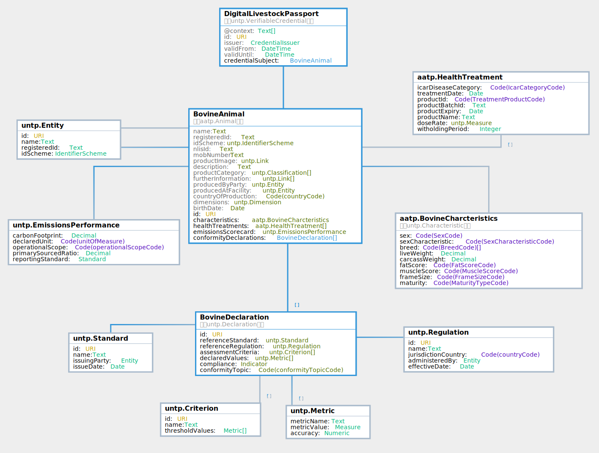

import Disclaimer from '../\_disclaimer.mdx';

<Disclaimer />

## UNTP Extension

The AATP digital product passports are all commodity-specific extensions of the [UNTP Digital Product Passport](https://uncefact.github.io/spec-untp/docs/specification/DigitalProductPassport). Implementers should familiarise with the UNTP DPP before implementing this AATP Livestock passport specificaiton.

* The AATP Digital Livestock Passport (DLP) adds Bovine characteristics and animal health treatment records based on the Meat and Livestock Australia (MLA) [national bovine livestock language guidelines](https://www.ausmeat.com.au/media/1521/mla-national-livestock-guidelines-2022-web_final_291122.pdf).
* The AATP Digital Horticulture Passport (DHP) adds horticulture product characteristics and phyto-sanitary treatment history (eg fumigation, pesticide use etc) as per Hort Australia and Codex Alimentarius guidelines. 

## Versions

| Type | Version | Date | dependency | status | JSON-LD Context | JSON Schema | Sample |
| --- | ---- | ------ | --- | --- | ---| ---| --|
| DLP  |  0.3.2 |  26-08-2024 | [UNTP Core v 0.3.9](https://test.uncefact.org/vocabulary/untp/core/0/about) | Draft | [@context](../../schema/aatp-dlp-context-0.3.2.jsonld)  | [schema](../../schema/aatp-dlp-schema-0.3.2.json)| [sample](../../samples/aatp-dlp-sample-0.3.2.json) |

## Livestock Extensions (DLP)

The AATP Digital Livestock Passport (DLP) adds Bovine characteristics and animal health treatment records based on the Meat and Livestock Australia (MLA) [national bovine livestock language guidelines](https://www.ausmeat.com.au/media/1521/mla-national-livestock-guidelines-2022-web_final_291122.pdf).

### DLP Logical Model

The key information components of the DLP are shown in the logical model diagram

* The root structure is the `DigitalLivestockPassport` which follows the [W3C Verifiable Credential Data Model (VCDM) v 2.0](https://www.w3.org/2018/credentials/).  Implementation guidance for VCDM is described at the [UNTP Verifiable Credentials](https://uncefact.github.io/spec-untp/docs/specification/VerifiableCredentials) page.
* The `credentialSubject` is a `BovineAnimal` which is itself an extension of the AATP `Animal` object. The core properties of `BovineAnimal` are the same as AATP `Animal` except that `BovineCharacteristics` and `HealthTreatments` have been added.
* The `BovineDeclarations` structure is used as the carrier for product conformity and sustainability data including emissions intensity, deforestation status, and so on.  It is the same as the UNTP `Declarations` structure except that reference standards, regulations, and criteria are scoped to the compliance rule sets that impact Australian Livestock. 

### DLP Data Definitions

Browse the [classes, properties, and code-lists used in the DLP](https://jargon.sh/user/aatp/DigitalLivestockPassport/v/0.3.2/artefacts/readme/render).  

### DLP Conformity Vocabulary

TBC - need to develop the conformity catalog and relevant livestock profile.

### Working Sample

TBC - link to a live DLP implementation with rendering template. 

## Horticulture Extensions

## Grains Extensions

