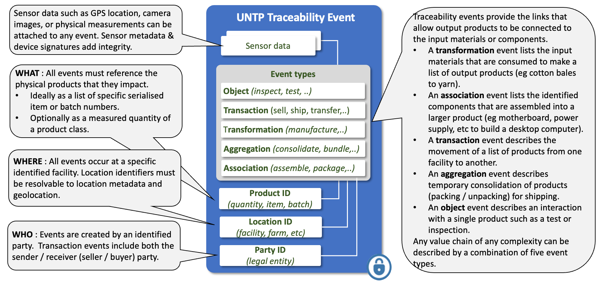
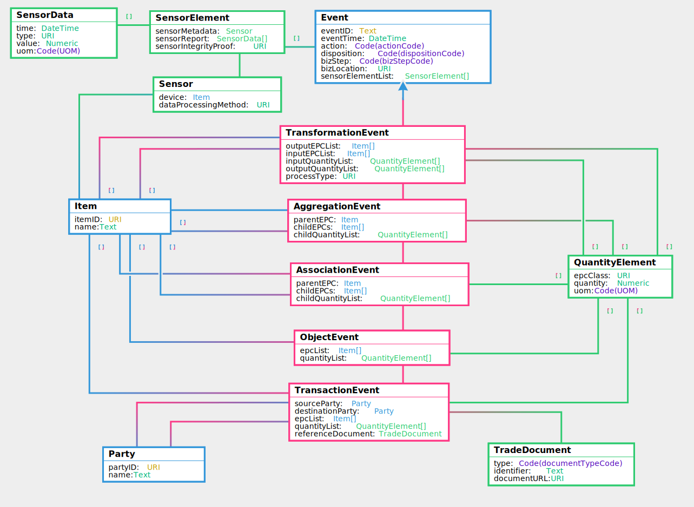

import Disclaimer from '../\_disclaimer.mdx';

<Disclaimer />

## Versions

|traceability Version|Date|status|JSON-LD Context|
|--|--|--|--|
| | | | |


## Overview

Traceability events are very lightweights collections of identifiers that specify the “what, when, where, why and how” of the products and facilities that constitute a value chain. The AATP is based on the [GS1 EPCIS](https://www.gs1.org/standards/epcis) standard for this purpose because it is an existing and proven mechanism for supply chain traceability. Note that UNTP supports but does not require the use of GS1 identifiers. The basic idea behind the traceability event structure is that any supply chain of any complexity can always be accurately modeled using a combination of four basic event types. An **object** event describes an action on specific product(s) such as an inspection. A **transaction** event describes the exchange of product(s) between two actors such as sale of goods between seller and buyer. An **aggregation** event describes the consolidation or de-consolidation of products such as stacking bales of cotton on a pallet for transportation. An **association** event describes the assembly of sub-components to make a composite product. Finally, a **transformation** event describes a manufacturing process that consumes input product(s) to create new output product(s). The UNTP uses these events in a decentralised architecture as the means to traverse the linked-data "graph" that represents the entire value-chain.

## Conceptual Model



## Requirements

The traceability event is designed to meet the following detailed requirements as well as the more general [UNTP Requirements(https://uncefact.github.io/spec-untp/docs/about/Requirements)]

|ID|Name|Requirement Statement|Solution Mapping|
|--|--|--|--|
| | | | |


## Logical Model

The UNTP logical model upon which AATP extensions re built 



## Livestock Industry Events

## Horticulture Industry Events

## Grains Industry Events

## Samples

### Object Event

```
{
  "epcList": [
    {
      "itemID": "http://example.com",
      "name": "string"
    }
  ],
  "quantityList": [
    {
      "epcClass": "http://example.com",
      "quantity": 0,
      "uom": "string"
    }
  ],
  "eventTime": "2019-08-24T14:15:22Z",
  "action": "observe",
  "disposition": "string",
  "bizStep": "string",
  "bizLocation": "http://example.com",
  "sensorElementList": [
    {
      "sensorMetadata": {
        "device": {
          "itemID": "http://example.com",
          "name": "string"
        },
        "dataProcessingMethod": "http://example.com"
      },
      "sensorReport": [
        {
          "time": "2019-08-24T14:15:22Z",
          "type": "http://example.com",
          "value": 0,
          "uom": "string"
        }
      ],
      "sensorIntegrityProof": "http://example.com"
    }
  ]
}

```

### Transaction Event

Note that the sensorElementList property exists in the transaction event but is not expanded in the sample below for brevity purposes.

```
{
  "sourceParty": {
    "partyID": "http://example.com",
    "name": "string"
  },
  "destinationParty": {
    "partyID": "http://example.com",
    "name": "string"
  },
  "epcList": [
    {
      "itemID": "http://example.com",
      "name": "string"
    }
  ],
  "quantityList": [
    {
      "epcClass": "http://example.com",
      "quantity": 0,
      "uom": "string"
    }
  ],
  "referenceDocument": {
    "type": "string",
    "identifier": "string",
    "documentURL": "http://example.com"
  },
  "eventTime": "2019-08-24T14:15:22Z",
  "action": "observe",
  "disposition": "string",
  "bizStep": "string",
  "bizLocation": "http://example.com",
  "sensorElementList": [..]
}
```

## Aggregation Event

Note that the sensorElementList property exists in the transaction event but is not expanded in the sample below for brevity purposes.

```
{
  "parentEPC": {
    "itemID": "http://example.com",
    "name": "string"
  },
  "childEPCs": [
    {
      "itemID": "http://example.com",
      "name": "string"
    }
  ],
  "childQuantityList": [
    {
      "epcClass": "http://example.com",
      "quantity": 0,
      "uom": "string"
    }
  ],
  "eventTime": "2019-08-24T14:15:22Z",
  "action": "observe",
  "disposition": "string",
  "bizStep": "string",
  "bizLocation": "http://example.com",
  "sensorElementList": [..]
}
```

### Transformation Event

Note that the sensorElementList property exists in the transaction event but is not expanded in the sample below for brevity purposes.

```
{
  "outputEPCList": [
    {
      "itemID": "http://example.com",
      "name": "string"
    }
  ],
  "inputEPCList": [
    {
      "itemID": "http://example.com",
      "name": "string"
    }
  ],
  "inputQuantityList": [
    {
      "epcClass": "http://example.com",
      "quantity": 0,
      "uom": "string"
    }
  ],
  "outputQuantityList": [
    {
      "epcClass": "http://example.com",
      "quantity": 0,
      "uom": "string"
    }
  ],
  "processType": "http://example.com",
  "eventTime": "2019-08-24T14:15:22Z",
  "action": "observe",
  "disposition": "string",
  "bizStep": "string",
  "bizLocation": "http://example.com",
  "sensorElementList": [..]
}
```

### Association Event

Note that the sensorElementList property exists in the transaction event but is not expanded in the sample below for brevity purposes.

```
{
  "parentEPC": {
    "itemID": "http://example.com",
    "name": "string"
  },
  "childEPCs": [
    {
      "itemID": "http://example.com",
      "name": "string"
    }
  ],
  "childQuantityList": [
    {
      "epcClass": "http://example.com",
      "quantity": 0,
      "uom": "string"
    }
  ],
  "eventTime": "2019-08-24T14:15:22Z",
  "action": "observe",
  "disposition": "string",
  "bizStep": "string",
  "bizLocation": "http://example.com",
  "sensorElementList": [..]
}
```

## Working Examples

TBC
