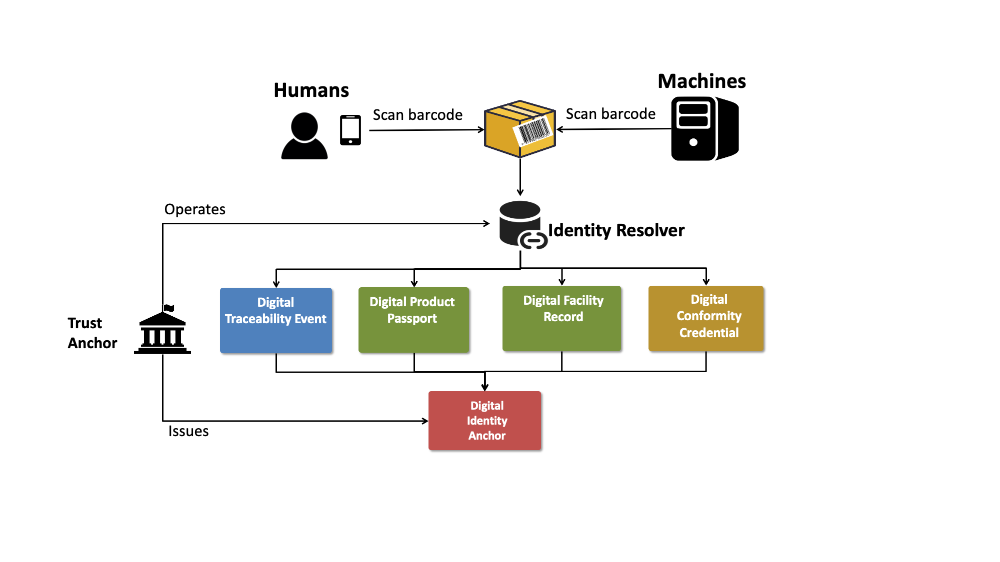

import Disclaimer from '../\_disclaimer.mdx';

<Disclaimer />

The specification is the heart of AATP.  It defines the detailed specifications for interoperable implementations. This page provides an outline of the purpose and scope of each component of the specification.

## Architecture 

The AATP is a decentralised verifiable linked data architecture, described in detail on the [UNTP Architecture page](https://uncefact.github.io/spec-untp/docs/specification/Architecture). This architecture is chosen because it is by far the most scalable and cost effective approach to data sharing.  

* A single centralised platform that contains the data from all actors in a value chain cannot scale because competitive pressures will not allow a single monopoly. Even if mandated through regulation, such an approach could only scale within one country. Each actor must be free to make their own choice about solution providers, just as each is free to choose their preferred bank - and still make payments via any other bank.
* So data is inevitably distributed across hundreds or thousands of systems. Connecting them together via traditional system-to-system integration (eg through APIs) also cannot scale because the number of interconnects required grows as the square of the number of systems. Connecting any of 1000 system to each other requires a million interconnects.  
* A linked data architecture works more like the web.  Each party publishes their own data such as digital product passports in such a way that it is discoverable by any other party that knows the product or facility identifier. If you have an identifier of a thing then you can pull the data about the thing. When the published data is both machine readable and human readable then there is no dependency on other systems. This architecture scales linearly. 1000 systems need only 1000 integrations. 

Centralised systems or API interconnections can work for low volume pilots but will never scale economy wide, much less globally.  

## How it works

There are five key credential types that value chain actors will issue under AATP. And all are discoverable through "identity resolvers" operated by the issuers of key identifiers (NLIS, PIC, ABN, GTIN). The identifier is the signpost and it points to the relevant credentials.  

* [Product passports](DigitalProductPassport) are issued by growers and processors and are essentially a carrier of all product data necessary for the product buyer to meet their safety, environment, or social due-diligence obligations. 
* [Traceability Events](DigitalTraceabilityEvent) are issued by feedlots, silos, distributors, and processors and serve to map input products (and their passports) to output products (and their passports) - thereby allowing the value chain traceability linked data to be followed.  
* [Conformity credentials](ConformityCredential) are issued by independent auditors or certifiers and attest to the validity of the claims made in digital product passports - thereby adding trust and verification to the ecosystem.
* [Identity Anchors](Identifiers) provide a simple way to scale identity assurance.  Rather than having to record and trust (whitelist) the digital IDs of every actor in the value chain, verifiers need only trust the few authorities that issue identifiers like ABNs and PICs.

